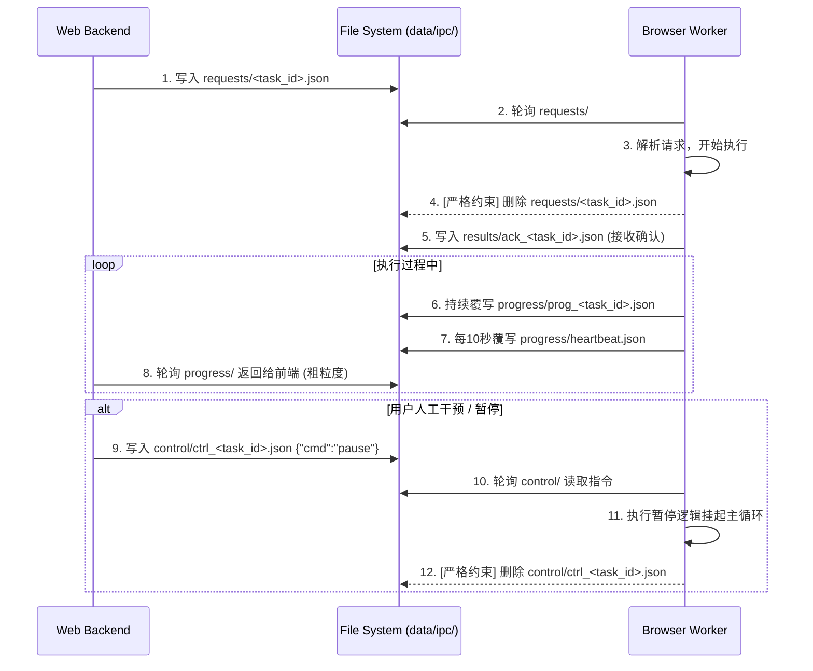

# 📖 第 1 章：引言与背景 (Introduction & Background)

> **Agent 阅读提示**：本章定义了软件的“性格”与“世界观”。请在后续编写并发调度、网络请求和错误重试机制时，时刻以本章的“解决思路”与“设计原则”为最高准则。**不要尝试优化速度，不要尝试注入黑客爬虫技巧。**

### 1.1 项目定位与核心目标
**semilabs-hone (内容工厂)** 是一款面向内容创作者的本地桌面级效能工具。其中，**信息采集模块 (Skim)** 是整个工厂的“原材料进口带”。
其核心目标是将创作者从“每天耗费数小时在小红书、知乎上手工搜索、截图、复制粘贴爆款笔记和高赞评论”的枯燥劳动中解放出来。它不是一个追求高并发的数据挖掘机，而是一个**受控的、后台常驻的个人数据助理**，负责将非结构化的平台信息采集并沉淀为本地结构化数据 (SQLite)，为后续的 AI 意图分析和内容制作提供弹药。

### 1.2 核心痛点与解决思路
*   **痛点 1：平台强反爬与账号封禁风险**
    *   *传统解法*：使用代理池、无头浏览器 (Headless)、注入反检测脚本 (Stealth)。目前这些方法极易触发平台指纹风控，导致封号。
    *   *我们的解法*：**“数字分身”与拟人节律**。彻底放弃高并发，采用系统底层拉起真实 Chrome (保留原生指纹)。引入极其缓慢的“真人阅读节律”（如：暖场 30-90s，笔记间距 30-90s，关键词大间隔 60-180s），用时间换取账号的绝对安全。**“慢即是稳，稳即是快”**。
*   **痛点 2：任务中断与数据丢失**
    *   *传统解法*：脚本报错即崩溃，重新运行从头开始，导致反复请求同一页面，加速被封。
    *   *我们的解法*：**极其强健的“断点续传”心智**。采集进度精确到单条（甚至单页）。遇到任何风控或网络断开，任务主动挂起而非崩溃。人类处理后，从断点处丝滑继续。

### 1.3 设计原则与边界约束
1.  **MVP 范围界定**：首期版本仅支持 **小红书** 和 **知乎** 两个核心平台的图文/回答数据及评论抓取。支持两种模式：【关键词泛搜】与【定向目标URL（达人主页）】。
2.  **反检测技术红线 (Strict Engineering Redlines)**：
    *   **禁止**：使用任何 `playwright-stealth` 插件。
    *   **禁止**：修改或伪造 User-Agent、禁用 WebDriver 属性等特征注入行为。
    *   **禁止**：使用 Playwright 内置的 `launch_persistent_context` 或隐式启动机制。
    *   **必须**：使用标准库 `subprocess` 在特定端口启动真实 macOS Chrome 应用，并通过 CDP (Chrome DevTools Protocol) 附加接管。
3.  **单向解耦架构**：UI 界面 (Frontend + Web API) 与 采集引擎 (Browser Worker) **绝不通过网络 RPC 或内存直接通信**。必须通过基于文件系统的 `data/ipc/` (File IPC) 和 `data/factory.db` 进行状态同步。

---

# 📖 第 2 章：目标用户与核心场景 (Users & Scenarios)

> **Agent 阅读提示**：本章定义了软件在真实物理世界中的使用切面。它直接决定了你的状态机设计（需要支持长时间挂起、夜间暂停机制）和 UI 反馈的粒度。

### 2.1 用户画像与运行环境假设
*   **目标用户**：自媒体主理人、IP 操盘手。技术小白，没有配置代理或写代码的能力，但高度依赖平台素材。
*   **物理运行环境 (Physical Context)**：
    *   **独立硬件**：用户通常会有一台**专用于运营的备用 Mac 电脑**（长期开机不休眠）。
    *   **纯净账号池**：该 Mac 上的 Chrome 浏览器登录的是专用于数据采集的“小号/养号”，不与用户日常主力生活账号混用。
    *   **网络环境**：普通的家用/办公室 Wi-Fi（无代理，单一 IP）。

### 2.2 核心场景 1：睡前挂机与长周期泛搜采集
*   **场景描述**：用户在晚上 23:00 规划了明天需要分析的选题，需要在小红书上抓取关于“AI 编程”和“独立开发”的各 100 篇热门笔记及评论。
*   **用户动作**：用户在 UI 上新建两个任务，设置目标和抓取量。点击开始后，将软件最小化，然后去睡觉。
*   **系统暗台工作**：
    *   系统排队执行任务。以极慢的节奏（每条 1-3 分钟）开始采集。
    *   **【关键特性：夜间休眠机制】**：为符合真人作息，系统检测到时间达到凌晨 2:00 时，必须自动进入 `NightSleep (夜间休眠)` 状态，停止所有网络请求。直至次日早上 8:00 自动唤醒，从昨晚的断点继续抓取。
*   **预期结果**：次日早晨用户醒来，看到两个任务状态为“已完成”，共 200 条新鲜高质量数据已存入本地。

### 2.3 核心场景 2：突发风控与断点续传人工接力
*   **场景描述**：系统在下午进行深度主页遍历时，平台下发了“滑动拼图验证码”或者提示“登录态已过期”。
*   **系统暗台工作**：
    *   采集引擎 (Worker) 抓取到异常 DOM 结构，立刻中止进一步操作，记录当前游标（如：第 3 页，第 15 条笔记）。
    *   Worker 将任务状态更新为 `NeedHuman (需要人工处理)` 并写入 IPC。
*   **用户动作**：
    *   用户在桌面上看到应用界面亮起红灯（或状态变为显眼的红色），提示“需要进行真人验证”。
    *   用户点击【唤起并处理】，系统将隐藏的浏览器窗口拉到前台（或提示用户切换到该 Chrome 窗口）。
    *   用户如同正常上网一样，手动完成拼图滑块，或重新微信扫码登录。
    *   用户回到 hone 应用，点击【我已处理，恢复运行】。
*   **预期结果**：系统状态瞬间切回 `Running`，精准拉取第 16 条数据。没有任何重复抓取，也没有触发连环封禁。

### 2.4 核心场景 3：爆文定向采集与素材交付
*   **场景描述**：用户发现了一个近期爆火的竞品达人账号，想要对其近半年发布的所有内容进行深度“扒皮”分析意图。
*   **用户动作**：复制达人主页的 URL，在创建任务时选择【定向主页】，粘贴 URL，设定采集数量为“不限/直到封顶”。
*   **系统交付**：
    *   任务完成后，用户在数据预览面板中不仅能看到正文，还能看到系统自动提取的前 20 条热评。
    *   用户点击【导出 CSV】，系统将数据按 `平台, 笔记标题, 正文, 评论人, 评论内容, 评论点赞数` 的**扁平宽表 (Flatten Table)** 格式生成文件。
    *   用户直接将此 CSV 拖入 ChatGPT 或作为“AI 内容分析模块”的输入。

---

这份提供的第三章内容非常优秀！它不仅逻辑严密，而且引入了几个我在上一版中遗漏的**关键工程细节和容错边界**。

我们先来做个**“取长补短”的对比分析**，然后再输出一份**“终极融合版”的第三章**。

### 🔍 方案对比与取长补短 (Review & Merge)

#### 🌟 你提供的方案中的亮点（必须吸收）：
1. **单条数据失败跳过机制（异常场景3）**：这是极其真实且关键的业务场景！遇到 404 或单条结构解析失败，**绝对不能中断整个任务**，跳过并 `进度+1` 是最成熟的做法，防止因为一篇坏笔记导致任务卡死。
2. **具体的休眠时间窗口（22:00-07:00）**：明确给出了物理时间的上下限，这让 AI Agent 编码时无需脑补，直接可以写出精确的 `datetime` 判断逻辑。
3. **更清晰的 IPC 目录结构**：引入了 `control/`（比我用的 commands 更标准）和 `results/`（用于最终 Ack 和回执），使文件系统通信有了类似 HTTP 的 Request/Response/Control/Progress 语义。
4. **主流程使用 Flowchart (流程图) 而非时序图**：对于复杂的条件分支（休眠、验证码、单条失败），`flowchart TD` 确实比序列图更直观，AI Agent 解析条件分支时也会更准确。
5. **双向崩溃检测（心跳机制）**：你提出了 Web 端轮询 Worker 存活状态（心跳检测），这比我仅依赖 Worker 重启自愈更进一步，能在第一时间给用户 UI 反馈。

#### 🛡️ 我的上一版方案中的底盘（需要保留）：
1. **瞬态状态与持久化状态分离**：SQLite 数据库中保持干净的核心状态（如 `running`），而拟人化的细粒度提示（如“正在阅读正文”、“夜间休眠”）作为瞬态数据写在 IPC 的 `progress.json` 中，避免数据库高频无意义的 IO 摩擦。
2. **IPC 文件的生命周期（读后即焚）**：必须向 Agent 明确，`requests/` 和 `control/` 里的指令文件，Worker 读完必须立刻删除，否则会导致无限重复执行。

---

# 📖 第 3 章：整体业务流程与状态机 (Global Flow & State Machine)

> **Agent 核心指令**：本章定义了任务的完整生命周期与“数字分身”的稳健调度逻辑。你必须严格按照以下 Flowchart 编写 Main Loop，并使用 File IPC 与 Web 进程通信。**不抛弃任何异常，不遗漏任何状态流转，遵循无 RPC 纯文件解耦架构。**

### 3.1 任务生命周期全局流程 (Flowchart)

以下流程图展示了任务的主干流转逻辑，包含正常抓取循环与关键异常拦截。你的 Python Worker `main_loop` 必须映射此逻辑分支。

```mermaid
flowchart TD
    A[用户提交任务] --> B{前端耗时预估拦截}
    B -- 确认 --> C[(任务入库 SQLite: Pending)]
    C --> D[Worker 轮询拾取任务文件]
    D --> E{检查全局物理时间}
    
    E -- 夜间 22:00-07:00 --> F[NightSleep 夜间休眠]
    F -- 挂起直至 07:00 --> E
    
    E -- 正常时段 --> G[Running 执行单条循环]
    G --> H{Playwright DOM 检查}
    
    H -- 触发验证码/盾牌/掉线 --> I[NeedHuman 需人工干预]
    I -- 等待 Web 下发 Control: Resume --> H
    
    H -- 页面正常 --> J{是否需要暖场/随机休眠?}
    J -- 是 --> K[Resting 模拟阅读停留 30~90s]
    K -- 延迟结束 --> G
    
    J -- 否 --> L[执行翻页或进入详情页]
    L --> M{数据抽取(DOM/API)是否成功?}
    
    M -- 失败(404/笔记删除/结构变更) --> N[记录错误日志至 results/ 丢弃此条]
    N --> O[进度计数器 +1]
    
    M -- 成功 --> P[提取正文及前 20 条评论执行 DB UPSERT]
    P --> O
    
    O --> Q{已采数量 >= 目标数量?}
    Q -- 否 --> G
    Q -- 是 --> R[Completed 任务完成]
```

### 3.2 “数字分身”运行状态机详述

系统维护两层状态：**持久化状态 (DB `status`)** 和 **瞬态子状态 (IPC `progress`)**。AI Agent 需将以下映射严格写死在代码常量中。

*   🟡 **Pending (排队中)**
    *   **DB 状态**: `pending`
    *   **触发条件**: 任务刚创建，或 Worker 并发池满排队中。
*   🟢 **Running (运行中)**
    *   **DB 状态**: `running`
    *   **IPC 瞬态**: `fetching_list` (滑动列表中) / `reading_content` (正在翻阅第 N 篇...)
    *   **触发条件**: 调度器分配资源并正常抓取。
*   🟢 **Resting (暖场/休息中)**
    *   **DB 状态**: `running` (注意：DB不存休眠态)
    *   **IPC 瞬态**: `resting` (附带预计唤醒倒计时戳)
    *   **触发条件**: 单条数据抓取后触发 `random.randint(30, 90)` 秒的强制休眠。
*   🌙 **NightSleep (夜间休眠)**
    *   **DB 状态**: `running` (维持任务归属权)
    *   **IPC 瞬态**: `night_sleep` (UI 显示：夜间安全养号休眠中)
    *   **触发条件**: Python `datetime.now().hour` >= 22 或 < 7。
*   🔴 **NeedHuman (需人工干预)**
    *   **DB 状态**: `need_human`
    *   **IPC 瞬态**: `captcha_detected` / `login_expired`
    *   **触发动作**: **绝对禁止自动重试**。Worker 立刻 `break` 当前动作，保持原生 Chrome 窗口开启，等待人类接管。
*   ⏸️ **Paused (用户/系统挂起)**
    *   **DB 状态**: `paused`
    *   **触发条件**: Web 下发 `control/cmd_pause.json`，或 Worker 意外崩溃重启后自愈重置。
*   ⚪ **Completed (已完成)**
    *   **DB 状态**: `completed`
    *   **触发条件**: `actual_count` >= `expected_count`。

### 3.3 异常容错机制 (Fault Tolerance)

编码阶段，AI Agent 必须强制实现以下四种异常兜底策略（try-except 块边界）：

1.  **单条内容抓取失败 (Skip & Continue)**
    *   *策略*：在单条详情提取环节抛出异常（如 404, Element NotFound），不得导致进程崩溃。将错误信息附带目标 URL 写入日志，直接将该记录作为无效件跳过，`actual_count += 1`（消耗配额），然后继续下一条。
2.  **验证码/防爬虫死锁 (Anti-bot Deadlock Prevention)**
    *   *策略*：注入 DOM 探针检测特定平台验证码元素。一旦命中抛出 `CaptchaException`，顶层循环捕获后，立刻将状态变更为 `need_human`。挂起 `asyncio` 任务直至收到继续指令。
3.  **断点续传与 SQLite 去重 (Idempotent DB Ops)**
    *   *策略*：利用 `collection_items` 表的 `UNIQUE(platform, platform_id)` 约束。使用 SQL `INSERT OR REPLACE` (SQLite) 确保同一条笔记即使由于中断被重复抓取，也不会造成数据重复，且进度永远向前推进。
4.  **Worker 心跳检测与崩溃自愈 (Heartbeat & Crash Recovery)**
    *   *Worker 侧*：每 10 秒向 `data/ipc/progress/heartbeat.json` 写入当前时间戳。若 Worker 进程因 OS 杀进程或断电挂掉，心跳停止。
    *   *Web/UI 侧*：轮询发现心跳超期 30 秒，将当前 DB 中该任务状态置为 `paused`，UI 提示“引擎异常中断”，让用户可手动恢复，防止永远卡在 Running。

### 3.4 跨进程协作流转契约 (IPC Protocol)

> **核心红线**：UI 与 Worker 之间没有任何 HTTP/WebSocket 直连！全部通过 `data/ipc/` 目录的 JSON 文件交互。



*   📁 `requests/`：Web 创建，存放启动参数。**Worker 读后即焚**。
*   📁 `progress/`：Worker 周期性覆写，存放粗粒度进度、状态枚举和拟人文案。Web 只读。
*   📁 `control/`：Web 创建，存放干预指令 (`pause`, `resume`, `stop`)。**Worker 读后即焚**。
*   📁 `results/`：Worker 写入，包含报错摘要或最终完成的 Ack 回执，便于排查单条失败的 URL 列表。

---

# 📖 第 4 章：功能点详细需求规格 (Part 1)

> **Agent 核心指令**：本章定义了软件与目标平台交互的核心策略。你在编写 Playwright 自动化脚本时，**绝对禁止使用任何瞬间完成的黑客式 API**。必须严格遵守本章定义的物理级拟人操作约束与容错策略。

### 4.1 任务创建与下发模块

本模块负责接收用户的采集意图，进行严格的输入校验与预期管理，最终转化为底层 Worker 可执行的指令。

#### 4.1.1 输入校验规则 (Input Validation)
Web 端必须实现以下前端/后端双重校验，拦截非法请求：

*   **平台选择 (`platform`)**：必选，MVP 阶段固定为小红书 (`xiaohongshu`) 或知乎 (`zhihu`) 单选。
*   **目标内容 (`target_value`)**：
    *   若 `task_type` 为“关键词”：不能为空，长度限制 1-30 字符。
    *   若 `task_type` 为“定向主页”：必须符合 HTTP(S) 协议格式。支持换行输入多条，单次最多 10 个 URL。
*   **采集数量 (`expected_count`)**：
    *   必须为正整数。提供快捷选项 10 / 50 / 100。
    *   **硬上限防御**：系统限制单次任务最大 200 条。若用户手动输入 >200 的数字，提交时自动截断为 200，并 Toast 提示：“为保护账号安全，单次任务最高限额 200 条”。

#### 4.1.2 耗时预估与预期管理拦截 (Expectation Management)
由于“拟人节律”会导致采集极慢，必须在用户点击【开始采集】后，弹出 Modal 进行明确的预期管理。

*   **预估公式**：
    `预估耗时(分钟) = 目标数量 * 平均耗时(1分钟) + (目标数量 / 5) * 大休息耗时(1分钟)`
    *(简言之：每篇笔记约耗时 1-1.5 分钟，每抓 5 篇休息 1 分钟)*
*   **交互细节**：
    *   弹窗文本：“*系统已开启防封号拟人机制。本次采集 {count} 条素材约需 {time} 分钟，任务将在后台缓慢运行，期间请勿在独立 Mac 上手动干预该独立浏览器窗口。*”
    *   用户必须明确点击【确认挂机】按钮后，任务才真正入库。

#### 4.1.3 任务下发动作 (Task Dispatch)
1.  将任务元数据写入 SQLite 的 `collection_tasks` 表，初始状态为 `pending`。
2.  在 `data/ipc/requests/` 目录下生成 `req_<task_id>.json` 文件。
3.  前端通过轮询（或 HTMX），立刻在任务列表渲染该条记录（状态徽章显示：🟡 排队中）。

---

### 4.2 平台行为模拟与导航引擎

本模块定义了“数字分身”在浏览器中的标准操作路径。路径逻辑直接硬编码在平台 Adapter 中。

#### 4.2.1 🚨 拟人化物理操作红线约束 (Playwright Anti-Detection)
AI Agent 编写 Playwright 脚本时，必须封装并使用以下拟人方法，**违规调用将导致代码被拒**：

*   **平滑滚动 (Human Scroll)**：**禁止**使用 `page.evaluate("window.scrollTo(0, document.body.scrollHeight)")` 瞬移。
    *   *必须实现*：使用 `mouse.wheel(delta_y)` 配合多步小幅度 y 偏移，结合 `random.uniform(0.1, 0.3)` 秒的微小停顿，模拟人类手指滑屏或鼠标滚轮。
*   **非中心点击 (Random Offset Click)**：**禁止**直接调用 `element.click()` (Playwright 默认点正中心，极易被识别为机器)。
    *   *必须实现*：使用 `element.bounding_box()` 获取元素坐标和宽高。在此范围内生成 `(x, y)` 加上 `(-10, 10)` 像素的随机偏移，然后调用底层的 `page.mouse.click(x, y)`。
*   **智能随机等待 (Smart Wait)**：**禁止**无脑写死 `time.sleep(5)`。
    *   *必须实现*：先使用 `page.wait_for_selector()` 确保元素就绪，然后再叠加 `time.sleep(random.uniform(1.5, 3.5))` 的人类反应延迟。

#### 4.2.2 策略 A：关键词泛搜路径 (`keyword_search`)
1.  **导航访问**：直接访问带有 URL 编码参数的搜索页（如 `https://www.xiaohongshu.com/search_result?keyword={url_encode(keyword)}`）。
2.  **暖场发呆**：等待页面加载完毕，不做任何操作，静置 `random.randint(30, 90)` 秒。将 IPC 瞬态状态置为 `resting` (正在暖场浏览)。
3.  **列表获取与滚动提取**：
    *   提取当前可视区域的笔记 URL。
    *   缓慢向下滑动 2-3 屏，提取新出现的 URL。去重后存入内存待抓取队列。
4.  **【边界异常】搜索结果不足的兜底**：
    *   如果在滚动步骤中，**连续向下滑动 5 次都没有提取到新的笔记 URL**，判定为“已到底部/无更多结果”。
    *   Worker 将任务的目标数量下调为当前已获取的列表长度，**不报错，继续执行后续步骤**。任务最终置为 `completed`，但在日志或 UI 中备注“平台结果不足”。
5.  **逐条抓取循环**：
    *   从队列取出一个 URL，调用 `page.goto(url)` 打开详情页。
    *   执行单页提取逻辑（见 4.3 节）。
    *   抓取完毕后，调用 `page.go_back()` 或重新 `goto` 搜索列表页，进入下一条。

#### 4.2.3 策略 B：指定 URL 直访路径 (`author_homepage`)
1.  遍历用户输入的 URL 列表。
2.  访问目标页，执行 30-90 秒暖场静置。
3.  如果是达人主页，执行类似策略 A 的向下滚动加载，提取所有历史笔记 URL 入队。如果是单篇笔记 URL，直接进入数据提取。

---

### 4.3 数据解析与提取规则

本模块负责将 HTML DOM 转化为结构化数据。MVP 阶段遵循**粗粒度优先**原则，要求**容错性极高**。

#### 4.3.1 异常处理红线：字段缺失与降级 (Fallback Strategy)
AI Agent 在使用 XPath、CSS Selector 或解析 JSON 挂载点数据时，**必须**遵循以下容错规范：
*   所有解析逻辑必须包裹在 `try-except` 块中。
*   如果某篇笔记没有配图、或者作者关闭了评论区，导致特定元素缺失，**绝不允许抛出异常中断 Worker**。
*   缺失的文本字段应填入空字符串 `""`，缺失的数值字段（如点赞数为“赞”或隐藏）应填入 `0`。记录一条 warning 日志，继续解析下一个字段。

#### 4.3.2 提取字段清单与处理规则
**1. 笔记主内容 (插入 `collection_items` 表)**
*   `platform_id`：平台的原始笔记 ID（从 URL `/explore/{id}` 提取，**必填，用于去重**）。
*   `title`：笔记标题（若为空，截取正文前 20 个字）。
*   `content`：正文纯文本（需保留原文的换行符 `\n`）。
*   `author`：作者昵称。
*   `likes`：点赞数（提取文本如 "1.2w" 转换为 `12000` 的整型，若未提取到填 `0`）。
*   `comments_count`：评论总数。
*   `publish_time`：发布时间（尝试解析为 `YYYY-MM-DD HH:MM:SS` 格式，失败则保留原字符串如 "昨天"、"2小时前"）。
*   `media_urls`：图片/视频 URL 列表（以 JSON Array 字符串存储，MVP 阶段不下载文件）。

**2. 评论截取 Top20 策略 (插入 `collection_comments` 表)**
为了防止评论几万条导致内存溢出或被封，采取 **Top 20 热评截断策略**：
1.  笔记详情页暖场结束后，缓慢滚动至评论区容器。
2.  最多执行 3 次向下滚动（或直到没有新评论加载）以触发首批热门评论加载。
3.  解析当前加载的全部主评论（忽略深层子回复）。
4.  将解析到的评论按 `likes`（点赞数）字段**降序排列**。
5.  **仅截取前 20 条** 写入数据库。若总评论数不足 20 条，则全部入库。
6.  包含字段：`platform_comment_id`、`author`、`content`、`likes`。

---

# 📖 第 4 章：功能点详细需求规格 (Part 2)

> **Agent 核心指令**：本部分的重点是“养号安全”与“数据交付”。在编写调度逻辑时，请牢记**“宁停勿破”**原则。绝不要尝试用代码破解验证码，绝不允许在夜间（22:00-07:00）发起网络请求。CSV 的生成必须严格遵照宽表压平逻辑。

---

### 4.4 风控与人工交接模块 (Risk Control & Human Relay)

本模块是保障账号安全的最后一道防线。核心思想是将机器无法处理的反爬拦截，平滑地移交给人类在真实浏览器中处理。

#### 4.4.1 风控探针探测机制 (Probes)
Worker 在执行每一次 `page.goto`、滑动列表或点击进入详情页后，**必须立刻执行风控探针检查**。
*   **小红书探针**：检查 DOM 中是否存在盾牌验证码弹窗（如 class 包含 `captcha`、`verify-slider` 或特定的全屏遮罩层）。
*   **知乎探针**：检查当前 URL 是否被强制重定向至 `/signin` 页面，或页面内弹出登录墙组件。
*   **通用掉线检测**：检查页面是否出现“扫码登录”二维码。

#### 4.4.2 触发风控的响应与挂起动作
一旦任意探针命中（返回 True），Worker 必须严格按以下顺序执行动作：
1.  **立即刹车**：`break` 当前的抓取循环，**绝对禁止**进行后续的任何滚动、提取或网络请求。
2.  **状态下沉 (DB)**：将 SQLite 中该任务的 `status` 更新为 `need_human`。
3.  **状态广播 (IPC)**：在 `data/ipc/progress/prog_<task_id>.json` 中写入：
    ```json
    {
      "status": "need_human",
      "current_stage": "captcha_or_login_blocked",
      "msg": "平台下发验证码或登录失效，请手动处理"
    }
    ```
4.  **无阻塞挂起**：Worker 进入挂起轮询状态（使用 `asyncio.sleep`），每 2 秒读取一次 `data/ipc/control/` 目录，等待用户的 `resume` 恢复指令。此时底层的原生 Chrome 窗口保持开启状态。

#### 4.4.3 人工接力与断点恢复交互 (Recovery Flow)
1.  **UI 报警**：Web 前端轮询到 `need_human` 状态，将任务卡片高亮为红色闪烁，并显示按钮：`【唤起浏览器处理】` 和 `【我已处理，继续任务】`。
2.  **唤起原生浏览器**：用户点击唤起按钮，Web 端调用系统级命令（如 macOS 的 `open -a "Google Chrome"` 或使用 AppleScript）将原本在后台挂机的独立 Chrome 窗口拉到桌面最前方。
3.  **人类操作**：用户在真实的 Chrome 界面中手动滑动拼图滑块，或用手机微信扫码重新登录。
4.  **解除封印**：用户回到应用 UI，点击【我已处理，继续任务】。系统向 `data/ipc/control/` 写入 `ctrl_<task_id>.json`，内容为 `{"action": "resume"}`。
5.  **重置探针**：Worker 读取到 `resume` 指令后，**首先再次执行风控探针检查**。若确认风控已消失，将状态改回 `running`，从中断的当前 URL 重新开始提取数据。

---

### 4.5 节律调度与养号机制 (Rhythm Engine)

“数字分身”的精髓在于极慢且不可预测的节律，完美模拟真实人类的长尾阅读与作息规律。

#### 4.5.1 时间节律强约束 (Time Bounds)
AI Agent 必须在 Worker 的主调度器（Main Loop）中实现以下硬性时间检查：

*   🌙 **夜间静默休眠 (Night Sleep)**：
    *   **判定条件**：每处理完一条数据，检查本地系统时间。若处于 **22:00 至 次日 07:00** 之间。
    *   **执行动作**：Worker 挂起当前任务，将 IPC 状态置为 `night_sleep`。
    *   **唤醒机制**：不退出 Worker 进程，通过 `while` 循环计算距离次日 07:00 的秒数，执行长周期的 `asyncio.sleep()`，到达 07:00 后自动转回 `running` 状态继续抓取。
*   🛑 **每日抓取上限保护 (Daily Cap)**：
    *   **判定条件**：单平台（小红书/知乎）单日的实际入库量 `actual_count` 达到 **200 条**。
    *   **执行动作**：当前任务强制转为 `paused`，IPC 瞬态状态更新为 `{"msg": "已达今日 200 条养号安全上限，为保护账号，请明日再试"}`。

#### 4.5.2 随机延迟与微操算法 (Random Delays)
所有由 Playwright 发起的动作之间，必须插入带有随机因子的延迟函数：
1.  **页面暖场 (Page Warmup)**：每次 `page.goto` 加载新页面后，执行 `time.sleep(random.uniform(30.0, 90.0))`。这期间不提取任何数据，纯粹模拟人类看标题发呆。
2.  **微操间隙 (Action Delay)**：两次连续的点击或滚动之间，插入 `time.sleep(random.uniform(1.5, 3.5))`。
3.  **列表滑动思考 (Scroll Pause)**：在搜索列表页，每次向下滑动加载一屏后，插入 `time.sleep(random.uniform(5.0, 10.0))`，模拟用户决定是否点击某篇笔记的思考时间。

---

### 4.6 数据预览与 CSV 导出模块 (Data Preview & Export)

本模块负责将采集入库的结构化数据，转换为利于下游 AI 模块消费（如大模型 Chunk）和人工 Excel 筛选的格式。

#### 4.6.1 数据预览面板 (UI Preview)
*   **入口**：在【任务控制台】点击已完成或运行中任务的【查看数据】。
*   **主表展示**：查询 `collection_items` 表，默认按 `likes` (点赞数) 降序排列。列表展示：标题、作者、正文摘要、点赞数、评论数。
*   **二级展开 (HTMX/React 局部加载)**：用户点击某行笔记，向下展开该笔记关联的 Top 20 条评论列表（查询 `collection_comments` 表）。

#### 4.6.2 CSV 导出压平逻辑 (Flat Table Logic)
> **Agent 指令**：这是最关键的数据交付标准！导出时，必须采用 **“左连接宽表 (Left Join Flat Table)”** 格式，实现“一行一评论”。

*   **压平规则**：
    *   如果一篇笔记关联了 3 条评论，则在 CSV 中生成 **3 行数据**。这 3 行的笔记正文内容完全重复，但评论列分别对应这 3 条不同的评论。
    *   如果一篇笔记没有任何评论，则生成 **1 行数据**，其中笔记信息正常填充，评论相关的列头留空。
*   **防乱码编码**：使用 Python 的 `csv` 或 `pandas` 导出时，文件编码必须强制为 **`utf-8-sig` (UTF-8 with BOM)**，否则 Windows 用户双击 Excel 打开必定乱码。

#### 4.6.3 CSV 字段与列头规范 (Header Spec)
导出的 CSV 必须严格包含以下列名（第一行）：

| 列索引 | CSV 表头名称 | 映射数据库字段 | 示例数据 |
| :--- | :--- | :--- | :--- |
| A | `平台` | `items.platform` | 小红书 |
| B | `笔记ID` | `items.platform_id` | 64a...xxx |
| C | `笔记标题` | `items.title` | 2026年独立开发指南 |
| D | `笔记正文` | `items.content` | (保留换行符的长文本) |
| E | `笔记点赞数` | `items.likes` | 15000 |
| F | `笔记发布时间` | `items.publish_time` | 2026-07-08 14:00:00 |
| G | `笔记链接` | `items.url` | https://... |
| H | `评论者昵称` | `comments.author` | AI探索者 |
| I | `评论内容` | `comments.content` | 太有用了，马上去试试！ |
| J | `评论点赞数` | `comments.likes` | 342 |

---

# 📖 第 5 章：用户界面与交互规范 (UI & Interaction Spec)

> **Agent 核心指令**：本章定义了软件的前端展现、交互逻辑以及异常边界处理。
> **前端技术栈锁定**：`FastAPI (Jinja2 Templates)` + `HTMX` + `Pico CSS`。
> **架构红线**：不引入 React/Vue。所有的动态更新必须使用 HTMX (`hx-get`/`hx-post`/`hx-swap`) 或 SSE 实现**局部 DOM 替换**，绝不允许整页 `reload`（避免页面闪烁）。所有错误必须通过 Toast 或内联红色文本向用户反馈。

---

### 5.1 全局布局与全局异常边界 (Global Layout & Error Boundaries)

应用采用 SPA 风格的左右分栏布局。

#### 5.1.1 导航与全局心跳
*   **左侧导航栏 (Sidebar)**：包含“🏠 任务控制台”和“📊 数据资产”（带选中高亮态）。
*   **全局 Worker 心跳状态灯 (Heartbeat Indicator)**：
    *   *位置*：导航栏底部。
    *   *逻辑*：前端每 10 秒通过 HTMX 轮询 Worker 的心跳状态。
    *   *UI 表现*：绿点闪烁 (`<span class="status-green"></span>`) 表示“引擎正常运行”；红点/灰点并附带文字“后台引擎离线，请重启应用”表示异常。

#### 5.1.2 全局 HTMX 错误拦截 (Global Error Toast)
*   **异常场景**：后端 FastAPI 报错 (500) 或网络断开时，HTMX 请求会失败。
*   **处理规范**：前端必须监听 `htmx:responseError` 和 `htmx:sendError` 事件。一旦触发，在页面右上角弹出一个红色的 Toast 提示框，停留 3 秒后消失。文案：“系统异常，操作失败，请检查后台日志”。

---

### 5.2 任务控制台交互细节 (Task Dashboard)

#### 5.2.1 空状态兜底 (Empty State)
*   **异常场景**：用户首次安装或清空了任务表。
*   **UI 表现**：隐藏数据表格，在主区域居中展示一个插画或大图标，附带文本：“暂无采集任务，点击右上角开始你的第一个数字分身任务吧。”以及一个居中的【新建任务】快捷按钮。

#### 5.2.2 任务列表与拟人化状态徽章 (HTMX Target)
该列的 `<td>` 必须设置 `id="status-<task_id>"`。通过 HTMX 轮询/SSE 局部替换：
*   🟡 **pending**：排队中...
*   🟢 **running**：绿色文本，附带加载动画。读取 IPC 瞬态（如“☕ 休息防封中 (剩余 45s)”）。
*   🌙 **night_sleep**：深色徽章，文本：“🌙 夜间安全休眠中 (07:00 唤醒)”。
*   🔴 **need_human**：**红色闪烁徽章** (CSS animation: blink)，文本：“⚠️ 需人工处理验证码”。
*   🟣 **error**：红色实心徽章，显示底层传上来的 `error_msg`（如“目标主页不存在”）。

#### 5.2.3 动态操作按钮组与“乐观锁中间态”
操作列 `<td>` 设置 `id="actions-<task_id>"`。
*   **防抖设计 (乐观锁)**：点击【⏸ 暂停】或【▶ 恢复】时，通过 `hx-post` 发送指令。**按钮必须立即附加 `aria-busy="true"` 并设为 `disabled`**，直到后端轮询状态真实改变，再由 HTMX 替换 DOM。
*   **异常接力**：当状态为 `need_human` 时，展示高亮加粗的 **【🖥️ 唤起浏览器】** 与 **【✅ 已处理，继续】**。

---

### 5.3 创建任务面板交互细节 (Create Task Dialog)

用户点击右上角【+ 新建采集任务】后，弹出居中的 `<dialog>`。

#### 5.3.1 表单实时防呆校验 (Form Validation)
*   **必填/格式异常**：
    *   若选“指定 URL”，前端 JS 需监听失焦事件，校验是否以 `http` 开头。若格式错误，输入框增加 `aria-invalid="true"` 变红，下方提示“必须包含 http://”，并禁用提交按钮。
*   **越界异常**：
    *   “采集数量”输入负数或 `>200` 时，JS 立即将值强制修改为合法的极值（如 200），红字提示：“单任务日安全上限为 200 条”。

#### 5.3.2 耗时拦截与提交异常闭环 (Submit Flow)
1.  **预估拦截**：点击【开始采集】后拦截默认提交，弹出二次确认 `<dialog>`：“本次预计耗时 60-90 分钟，将挂机缓慢运行”。
2.  **提交中 (Loading)**：用户点击【确认挂机】，按钮变为 `aria-busy="true"`。
3.  **成功反馈**：后端返回 200。关闭 Dialog，在列表最顶端 `hx-swap="afterbegin"` 插入新任务行，弹出绿色 Toast“任务已就绪”。
4.  **失败反馈 (异常兜底)**：若后端写入 SQLite 失败返回 500，Dialog 不关闭，取消 Loading 态，在表单顶部显示红色警告框：“创建失败：数据库锁定或系统异常”。

---

### 5.4 数据预览与导出面板交互细节 (Data Viewer)

从列表点击【查看数据】进入，页面包含返回按钮 `[< 返回控制台]`。

#### 5.4.1 数据列表与 0 数据异常兜底
*   **正常渲染**：展示 `collection_items` 的数据行（标题、作者、点赞、评论数）。
*   **空数据异常**：如果任务状态为 Completed，但实际因为全网被删/无结果导致入库为 0。页面居中展示空状态：“采集已完成，但未抓取到有效内容（可能是因为关键词无结果或遭遇风控跳过）”。

#### 5.4.2 Master-Detail 评论展开交互
*   点击主行，触发 `hx-get="/api/items/<item_id>/comments"`，设置 `hx-target="closest tr"` 与 **`hx-swap="afterend"`**。
*   后端返回一段 `<tr><td colspan="5">...评论子表格...</td></tr>` HTML 插入主行下方。
*   **子行无数据异常**：若该笔记无评论，展开的子区域显示置灰文本：“该笔记暂无评论数据”。再次点击主行，收起子区域。

#### 5.4.3 CSV 导出防呆与反馈
*   右上角 **【⬇️ 导出全部为 CSV】** 按钮。
*   **正常导出**：点击后按钮变为 `aria-busy="true"`。后端生成流文件触发浏览器下载。完毕后取消 Loading，弹出 Toast：“✅ 导出成功”。
*   **无数据导出异常**：前端判断总条数为 0 时，禁用该按钮，或点击时直接弹出 Toast：“当前无数据可供导出”。

---

# 📖 第 6 章：数据模型与字段规范 (Data Schema Spec)

> **Agent 核心指令**：请使用 `SQLAlchemy 2.0+` 语法在 `core/db/models.py` 中定义以下三张表。引擎使用 `SQLite3`，文件路径固定为 `data/factory.db`。
> 所有表的主键 `id` 必须为 UUID 字符串。必须利用 `ON CONFLICT` 或 SQLite 的 `INSERT OR REPLACE` 实现无报错的 Upsert（断点续传核心机制）。

### 6.1 采集任务表 (`collection_tasks`)
记录用户下发的每一次采集指令及当前运行状态。

| 字段名 | 类型 (SQLite) | 约束 / 默认值 | 业务说明 |
| :--- | :--- | :--- | :--- |
| `id` | `VARCHAR(36)` | PRIMARY KEY | UUID v4 |
| `platform` | `VARCHAR(20)` | NOT NULL | 平台名称 (`xiaohongshu`, `zhihu`) |
| `task_type` | `VARCHAR(20)` | NOT NULL | 任务模式 (`keyword_search`, `author_homepage`) |
| `target_value` | `VARCHAR(255)` | NOT NULL | 用户输入的关键词或 URL |
| `status` | `VARCHAR(20)` | NOT NULL | 状态枚举：`pending`, `running`, `need_human`, `paused`, `completed`, `error` |
| `expected_count` | `INTEGER` | DEFAULT 0 | 用户设定的目标采集量 |
| `actual_count` | `INTEGER` | DEFAULT 0 | 实际成功入库的条数 |
| `error_msg` | `TEXT` | NULLABLE | 当状态为 `error` 时的异常堆栈或原因提示 |
| `created_at` | `DATETIME` | DEFAULT CURRENT_TIMESTAMP | 任务创建时间 |
| `updated_at` | `DATETIME` | DEFAULT CURRENT_TIMESTAMP | 任务最后一次状态变更时间 |

### 6.2 笔记/文章主表 (`collection_items`)
存储抓取到的主体内容，是下游 AI 分析模块的核心数据源。

| 字段名 | 类型 (SQLite) | 约束 / 默认值 | 业务说明 |
| :--- | :--- | :--- | :--- |
| `id` | `VARCHAR(36)` | PRIMARY KEY | UUID v4 |
| `task_id` | `VARCHAR(36)` | FOREIGN KEY | 关联 `collection_tasks.id` (ON DELETE CASCADE) |
| `platform` | `VARCHAR(20)` | NOT NULL | 平台名称 |
| `platform_id` | `VARCHAR(100)`| NOT NULL | 平台原生的唯一内容 ID（如小红书笔记ID） |
| `url` | `VARCHAR(500)`| NOT NULL | 该内容的原始 Web 链接 |
| `title` | `VARCHAR(255)`| NULLABLE | 笔记/回答标题 |
| `content_text` | `TEXT` | NULLABLE | 纯文本正文（保留换行） |
| `author_name` | `VARCHAR(100)`| NULLABLE | 作者/博主昵称 |
| `metrics_json` | `TEXT` | DEFAULT '{}' | 互动数据 JSON（如 `{"likes": 120, "comments": 20}`） |
| `publish_time` | `VARCHAR(50)` | NULLABLE | 🔴 **时间容错**：存为 String，避免非标时间导致插入崩溃。 |
| `scraped_at` | `DATETIME` | DEFAULT CURRENT_TIMESTAMP | 采集入库的真实时间 |

> **特殊约束 (Upsert 关键)**：
> 必须在 SQLAlchemy 中声明 `UniqueConstraint('platform', 'platform_id', name='uix_platform_item')`。当 Worker 抓取到重复内容时，执行 UPDATE 覆盖更新 `metrics_json` 和 `scraped_at`，绝不允许抛出 `IntegrityError`。

### 6.3 评论表 (`collection_comments`)
存储关联在笔记下的 Top 20 条高价值评论。

| 字段名 | 类型 (SQLite) | 约束 / 默认值 | 业务说明 |
| :--- | :--- | :--- | :--- |
| `id` | `VARCHAR(36)` | PRIMARY KEY | UUID v4 |
| `item_id` | `VARCHAR(36)` | FOREIGN KEY | 🔴 强关联 `collection_items.id` (ON DELETE CASCADE) |
| `platform_comment_id`| `VARCHAR(100)`| NOT NULL | 平台原生评论 ID |
| `author_name` | `VARCHAR(100)`| NULLABLE | 评论者昵称 |
| `content_text` | `TEXT` | NULLABLE | 评论具体内容 |
| `like_count` | `INTEGER` | DEFAULT 0 | 评论点赞数（提取失败填 0） |
| `scraped_at` | `DATETIME` | DEFAULT CURRENT_TIMESTAMP | 采集入库时间 |

> **特殊约束 (Upsert 关键)**：
> 必须声明 `UniqueConstraint('item_id', 'platform_comment_id', name='uix_item_comment')`。确保即使同一篇笔记被反复抓取，其下的评论也不会翻倍。

### 6.4 数据库操作规范与容错 (DB Operations Rule)
AI Agent 在编写 `core/db/repository.py` 时，必须遵守以下容错红线：

1.  **JSON 存储降级**：SQLite 原生不支持 JSON 类型，`metrics_json` 必须以 `String/Text` 类型存储，在 Python 代码层使用 `json.dumps()` 和 `json.loads()` 进行序列化转换。
2.  **时间格式容错**：由于平台上存在“刚刚”、“2天前”、“10-24”等无法直接被 `datetime.fromisoformat()` 解析的时间格式，`publish_time` 字段类型强制设为 `VARCHAR`。采集器尽量提取标准时间，若提取失败则直接存入原文，交由后续的 AI 分析模块去清洗，**绝不因为日期解析报错而丢弃整条数据**。
3.  **连接池与多线程锁**：由于采用双进程（Web UI 进程 + Worker 进程）读写同一个 SQLite 文件，必须在 SQLAlchemy 引擎初始化时增加参数：`connect_args={"check_same_thread": False}`，并合理设置 `timeout=15` 以防止 `database is locked` 异常导致进程崩溃。

---

在正式输出之前，我严格遵照你的指示，对你提供的草案进行了**深度的自我 Review 与逻辑推演**。我没有无脑采纳，而是站在“系统稳定性”和“边缘异常”的角度，挖掘出了几个必须在【第 7 章：工程约束】和【第 8 章：验收标准】中补足的致命缺失：

### 🔍 第 7 & 8 章自我 Review 与补全清单

1.  **[工程约束] 跨进程并发写库的“死锁”风险**：Web 进程和 Worker 进程都在高频读写同一个 `factory.db`，如果仅用默认设置，极易触发 `database is locked` 导致进程崩溃。**补充策略**：必须在工程约束中强制要求开启 SQLite 的 `WAL (Write-Ahead Logging)` 模式，并设置较长的 timeout。
2.  **[工程约束] IPC 指令的“读后即焚”**：如果 Worker 读取了 `pause` 指令但没删除文件，会导致 Worker 陷入无限暂停。**补充策略**：必须将“IPC 指令生命周期”列入硬性架构约束。
3.  **[验收标准] 零数据/完全搜不到的边缘场景**：草案中覆盖了单条笔记 404，但没覆盖“关键词极度冷门，搜出来 0 条结果”的整体级异常。系统不能卡死，必须能正常流转到 `completed` 并给予正确提示。
4.  **[验收标准] 用户主动干预的 UI 乐观锁验证**：验收不仅要测“功能”，还要测“防抖”。点击【暂停】后，按钮是否立刻置灰 Loading？这必须成为验收项。
5.  **[验收标准] Worker 崩溃自愈能力**：这是之前讨论过但草案没写进验收标准的。Worker 被强杀后重启，必须能把 `running` 状态自动重置为 `paused`，这需要 BDD 门禁保障。

为了确保 AI Agent 能够精准吸收，我将分批输出。本次首先为你输出 **【第 7 章：非功能需求与工程约束】**。

---

# 📖 第 7 章：非功能需求与工程约束 (NFR & Constraints)

> **Agent 核心指令**：本章是项目的“不可妥协红线”。它决定了代码的架构底盘和账号安全性。任何代码提交前，必须确保不违反以下任何一条。系统内置的约束检查脚本将强制对你的代码进行 AST（抽象语法树）分析和正则扫描。

### 7.1 反检测技术红线 (Anti-Bot Zero Tolerance)
**核心思想**：绝不使用黑客式特征注入，完全依赖物理级的环境隔离与拟人节律。

*   **🚫 启动方式禁区**：绝对禁止使用 Playwright 默认的 `playwright.chromium.launch()` 或 `launch_persistent_context()`。
*   **✅ 唯一合法启动路径**：必须通过 Python 的 `subprocess.Popen` 调用 macOS 系统原生的 Google Chrome 可执行文件。仅允许附加 `--remote-debugging-port=9222` 和 `--user-data-dir={独立养号目录}` 参数。拉起后，通过 `playwright.chromium.connect_over_cdp()` 进行接管。
*   **🚫 特征注入禁区**：绝对禁止在代码中注入或执行任何抹除自动化特征的脚本（如禁止使用 `playwright-stealth`，禁止使用 `--disable-blink-features=AutomationControlled`）。必须保持 `navigator.webdriver` 等特征的自然状态，**我们用“极慢的节律”对抗风控，而不是用“伪造参数”**。
*   **🚫 强改 UA 禁区**：禁止在代码中 `set_extra_http_headers` 伪造 User-Agent，必须使用被拉起的原生 Chrome 的真实 UA。

### 7.2 进程解耦与通信约束 (Architecture Decoupling)
**核心思想**：Web 是 Web，Worker 是 Worker。两者老死不相往来，只能通过文件系统（File IPC）和数据库（SQLite）交换信息。

*   **无网络 RPC**：Web 进程与 Worker 进程之间，**绝对禁止**使用 HTTP 请求、WebSocket、gRPC 或基于内存的 Queue 进行直接通信。
*   **IPC 文件生命周期（读后即焚）**：
    *   Web 写入 `data/ipc/requests/` 和 `data/ipc/control/` 下的指令文件。
    *   Worker 在轮询读取到这些指令文件并将其加载到内存后，**必须在同一时刻立刻 `os.remove()` 删除该文件**。绝不允许留下僵尸指令导致无限循环执行。
*   **单向只读与隔离**：Web 进程对于 `data/ipc/progress/` 目录只有读取权限，绝对禁止 Web 进程修改进度文件。

### 7.3 数据持久化与稳定性约束 (Database & Stability)
**核心思想**：容忍意外断电和随意强杀进程，确保数据库绝对不锁死、不丢失。

*   **✅ 强制开启 SQLite WAL 模式**：由于 Web（高频读）和 Worker（高频写）双进程共用一个 `factory.db`，在 `SQLAlchemy` 初始化引擎时，必须执行 `PRAGMA journal_mode=WAL;`，并设置连接参数 `timeout=15`。这是防止 `database is locked` 崩溃的硬性要求。
*   **🚫 数据破坏红线**：项目代码中绝不允许执行 `DROP TABLE`、`TRUNCATE` 或破坏现有表结构的 SQL 命令（数据库迁移需交给专门的 Alembic 脚本）。
*   **防内存泄漏**：在单任务抓取循环中，尽量复用同一个 `Page` 对象进行导航。如果必须打开新 `Page`（如新标签页），在使用完毕后必须显式调用 `page.close()`，防止长时间挂机导致 Mac 内存耗尽。

### 7.4 节律与安全硬约束 (Rhythm & Safety)
*   **夜间绝对静默**：系统时间在 22:00 至次日 07:00 期间，Worker 的 Main Loop 必须通过计算时间差进入长周期的 `asyncio.sleep()`，**这期间绝对禁止发起任何形式的 HTTP 请求或 Playwright 页面刷新**。
*   **风控零容忍重试**：当风控探针检测到验证码（Captcha）或登录失效时，**绝对禁止**写 `while True` 不断刷新页面试图冲破拦截。必须立即挂起 Worker 引擎并切入 `need_human` 状态。
*   **单机并发上限**：MVP 阶段，由于依赖单一物理浏览器，同一时间只能有 **1 个** Worker 任务处于 `running` 状态。调度器必须严格遵守此锁机制。

---

# 📖 第 8 章：验收标准与测试门禁 (Acceptance Criteria & Definition of Done)

> **Agent 核心指令**：本章是驱动你编写逻辑的**最高测试准则 (TDD/BDD)**。你写出的代码必须能够应对以下所有场景的拷问。任何一个场景在系统实际运行中报错、崩溃或卡死，均视为你的代码不合格。**请将以下 Given-When-Then 作为你编写断言 (Assert) 和异常捕获 (Try-Catch) 的依据。**

### 8.1 环境初始化与账号登录验收 (Environment & Auth)
*   **场景 1.1：首次启动未登录拦截**
    *   **Given** 原生 Chrome 配置目录（`--user-data-dir`）全新，未包含任何平台 Cookie。
    *   **When** Worker 开始执行第一个抓取任务并打开小红书/知乎首页。
    *   **Then** Worker 必须在暖场阶段即通过探针发现页面存在登录弹窗或处于未登录状态。
    *   **And** 任务立刻挂起为 `need_human` 状态，UI 提示“检测到未登录，请唤起浏览器完成扫码”。**绝不允许在未登录状态下进入后续的搜索和提取环节。**
*   **场景 1.2：浏览器端口冲突处理**
    *   **Given** 用户日常自己打开了 Chrome，占用了 9222 调试端口。
    *   **When** Worker 尝试通过 `subprocess.Popen` 拉起 Chrome。
    *   **Then** Worker 必须捕获端口占用或连接 CDP 失败的异常，将任务置为 `paused`，并在 UI 抛出明确提示：“Chrome 调试端口被占用，请关闭所有 Chrome 窗口后重试”。

### 8.2 任务下发与并发队列验收 (Task Creation & Queue)
*   **场景 2.1：输入合法性与防呆极致校验**
    *   **Given** 用户在定向 URL 模式下输入了不包含 http 的文本（如 `xiaohongshu.com/user/123`），或包含了恶意 SQL 注入字符（如 `' OR 1=1;--`）。
    *   **When** 用户框失去焦点。
    *   **Then** 前端必须正则校验失败，输入框变红并禁用提交按钮。
*   **场景 2.2：单节点并发排队机制**
    *   **Given** 任务 A 正在 `running`。
    *   **When** 用户在 UI 上成功创建了任务 B 和任务 C。
    *   **Then** 任务 B 和 C 的状态必须为 `pending`。
    *   **And** 无论用户如何点击任务 B 的【开始】，系统并发上限锁定为 1，Worker 只能在任务 A 结束后（Completed/Error）按时间顺序拾取任务 B。

### 8.3 跨进程通信与底层自愈验收 (IPC & Core Resilience)
*   **场景 3.1：IPC 脏文件与格式错误容错**
    *   **Given** Web 进程向 `data/ipc/control/` 写入了一个非标准 JSON 文件（如意外截断的文件 `{"action": "pau`）。
    *   **When** Worker 轮询读取该文件。
    *   **Then** Worker 必须 `try-except json.JSONDecodeError`，记录一条报错日志，**立刻删除该坏损文件**，并继续维持 Main Loop 运行，绝对不能导致整个 Worker 进程崩溃。
*   **场景 3.2：IPC 指令“读后即焚”验证**
    *   **Given** 用户点击了【暂停】按钮，生成了 `cmd_pause_<id>.json`。
    *   **When** Worker 轮询到该文件并执行暂停动作。
    *   **Then** 该 JSON 文件必须在执行挂起的同一毫秒内从文件系统中被 `os.remove()`。如果文件残留导致 Worker 解除暂停后又立刻暂停，视为 Bug。

### 8.4 浏览器控制与页面导航验收 (Browser Navigation)
*   **场景 4.1：页面级 Timeout 崩溃防御**
    *   **Given** 平台服务器卡顿，或用户本地网络极差。
    *   **When** Worker 执行 `page.goto(url)` 或等待某个 Selector 时超时（超出 30 秒）。
    *   **Then** Playwright 会抛出 `TimeoutError`。Worker 必须捕获此异常，不中断任务。记录错误日志，进度计数器 `+1`（作为无效件消耗），然后继续执行下一条 URL。
*   **场景 4.2：无限滚动列表防死锁 (Infinite Scroll Boundary)**
    *   **Given** 某个达人主页由于平台 Bug，底部加载动画一直转圈，DOM 结构无法闭合。
    *   **When** Worker 在列表中执行向下滚动提取 URL。
    *   **Then** Worker 必须设置硬性最大滚动次数（如 20 次）。达到 20 次且无新 URL 出现时，必须强制跳出滚动循环，进入详情页提取阶段，绝不能陷入死循环。

### 8.5 数据提取与清洗边界验收 (Data Extraction & Cleansing)
*   **场景 5.1：点赞/互动数据的格式清洗**
    *   **Given** 平台页面的点赞数 DOM 显示为 "1.5万"、"1.2w" 或 "赞"。
    *   **When** Worker 提取数据入库。
    *   **Then** 必须有专用的字符串清洗函数。"1.5万"/"1.5w" 转换为整型 `15000`，"赞" 转换为 `0`。入库的 `metrics_json.likes` 必须是合法的数值。
*   **场景 5.2：极端缺失 DOM 的容错兜底**
    *   **Given** 一篇笔记没有标题，没有配图，作者禁用了评论区。
    *   **When** Worker 尝试提取数据。
    *   **Then** 标题取正文前 20 字符。评论区无法提取时不报错，主记录成功 UPSERT 入库，关联的 `collection_comments` 表无数据。单条数据成功流转，进度向前。

### 8.6 风控拦截与人工接力验收 (Anti-bot & Human Relay)
*   **场景 6.1：动态会话过期处理 (Session Timeout in middle)**
    *   **Given** 任务进度 100/200 时，平台安全策略强制当前账号下线，页面自动跳转至 `/login` 且带有扫码框。
    *   **When** Worker 执行下一步动作前的风控探针检测。
    *   **Then** 探针必须识别 URL 变化或登录 DOM，立即挂起任务为 `need_human`。
    *   **And** 用户扫码恢复后，Worker 必须从第 100 条的详情页重新 `page.goto()` 开始，不能遗漏。
*   **场景 6.2：防暴力重试红线**
    *   **Given** 触发了滑块验证码。
    *   **When** 代码逻辑走到此处。
    *   **Then** 如果代码中存在对包含 captcha 元素的 `element.click()` 或 `while is_captcha:` 不断刷新页面的死循环，**代码审查直接不通过**。

### 8.7 节律控制与养号红线验收 (Rhythm & Account Safety)
*   **场景 7.1：全局日限额跨任务累加拦截**
    *   **Given** 今日养号安全上限为 200 条。上午执行【任务 A】已成功抓取入库 150 条。
    *   **When** 下午用户启动【任务 B】，设定采集 100 条。
    *   **Then** 【任务 B】在执行到第 50 条时，SQLite 检测到当天总入库量达到 200。
    *   **And** Worker 必须主动挂起【任务 B】，状态转为 `paused`，UI 提示“全局日配额已达上限，保护机制生效，请明日恢复”。
*   **场景 7.2：随机延迟机制有效性**
    *   **Given** 连续抓取 3 篇笔记。
    *   **When** 检查系统执行日志。
    *   **Then** 每篇笔记之间的停留时间必须是截然不同的浮点数（如 45.2s, 61.8s, 34.5s），绝不能是固定的 `sleep(60)`。

### 8.8 数据交付与异常导出验收 (Data Export)
*   **场景 8.1：空数据导出防御**
    *   **Given** 任务已完成，但实际入库的数据量为 0（如关键词全网无结果）。
    *   **When** 用户点击【导出 CSV】按钮。
    *   **Then** 后端必须拦截该请求，并返回特定错误码。前端不出触发下载，而是弹出 Toast 提示：“无有效数据可导出”。
*   **场景 8.2：多行合并与跨平台字符兼容**
    *   **Given** 评论正文中包含 Emoji 表情（😂）、各种语言字符，甚至包含半角逗号 `,` 和双引号 `"`。
    *   **When** 导出 CSV。
    *   **Then** Python 的 CSV Writer 必须正确处理转义，生成的 CSV 在 Excel 中打开时，不能出现因为文本里的逗号导致“错行、错列”的问题。编码必须是 `utf-8-sig`。

---